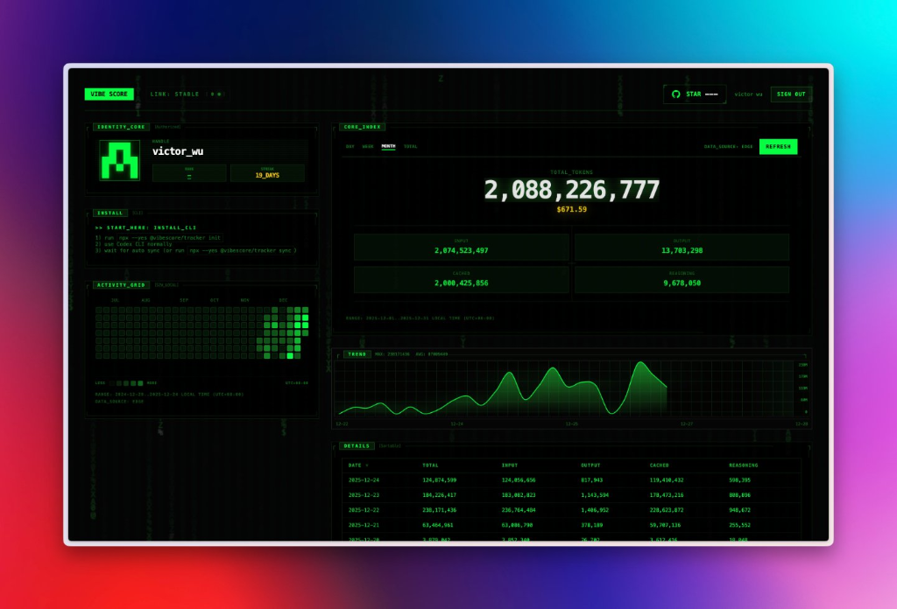
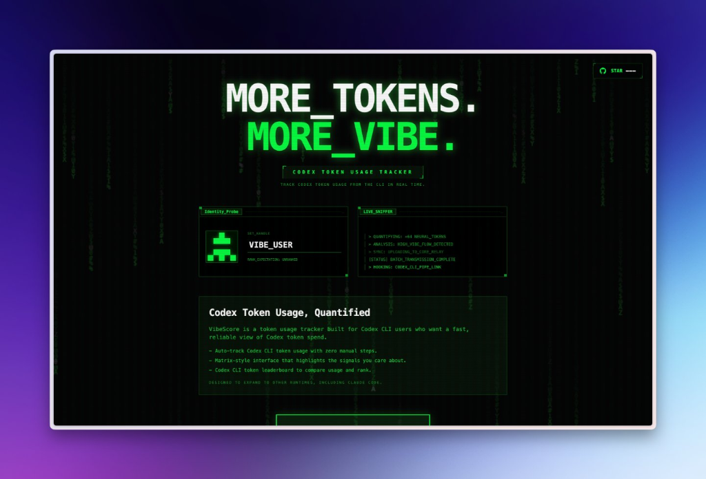
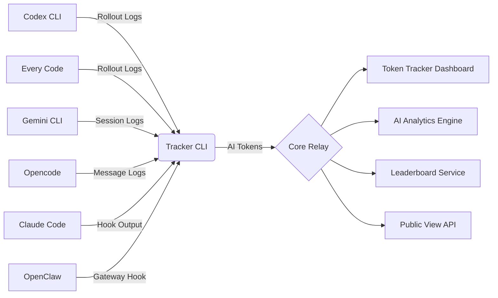

<div align="center">


# 🟢 TOKEN TRACKER

**QUANTIFY YOUR AI OUTPUT**
_Track AI Token Usage Across All Your CLI Tools_

[**www.tokentracker.cc**](https://www.tokentracker.cc)

[](https://opensource.org/licenses/MIT)
[](https://www.npmjs.com/package/vibeusage)
[](https://nodejs.org/)
[](https://www.apple.com/macos/)

[**English**](README.md) • [**中文说明**](README.zh-CN.md)

[**Documentation**](docs/) • [**Dashboard**](https://www.tokentracker.cc) • [**Backend API**](BACKEND_API.md)

<br/>



</div>

---

## 🚀 Quick Start

Get started in 30 seconds:

```bash
npx vibeusage init
```

That's it! Your AI token usage will now automatically sync to the [Dashboard](https://www.tokentracker.cc) 🎉

## ✨ Why Token Tracker?

- 📡 **Multi-Source Unified Tracking** - Support for Codex CLI, Every Code, Gemini CLI, Claude Code, Opencode, OpenClaw, and more
- 🤖 **Multi-Model Statistics** - Unified tracking for GPT-4, Claude, Gemini, o1, and all AI models
- 📁 **Project AI Footprint** - Track and publicly display token usage per repository, proving AI-assisted development
- 🏆 **Global Leaderboard** - Weekly/monthly/all-time rankings, grow with the global developer community
- 🌐 **Public Profiles** - Share your AI usage journey, optionally participate in leaderboards
- 🔒 **Privacy-First** - Only track numbers, never upload your code or conversations
- ⚡ **Zero-Config Auto-Sync** - Set up once, sync forever
- 🎨 **Matrix-A Design** - Cyberpunk-style high-fidelity dashboard
- 📈 **Deep Analytics** - Cost insights, trend forecasting, activity heatmaps

## 🧰 Supported AI CLIs

| CLI Tool | Auto-Detection | Status |
|----------|----------------|--------|
| **Codex CLI** | ✅ | Full Support |
| **Every Code** | ✅ | Full Support |
| **Gemini CLI** | ✅ | Full Support |
| **Claude Code** | ✅ | Full Support |
| **Opencode** | ✅ | Full Support |
| **OpenClaw** | ✅ | Full Support |

Whether you're using GPT-4, Claude 3.5 Sonnet, o1, or Gemini - all token consumption is unified and tracked.

## 🌌 Overview

**Token Tracker** is an intelligent token usage tracking system designed for macOS developers. Through the all-new **Matrix-A Design System**, it provides a high-fidelity cyberpunk-style dashboard that transforms your **AI Output** into quantifiable metrics, supported by the **Neural Divergence Map** for real-time monitoring of multi-model compute distribution.

> [!TIP]
> **Core Index**: Our signature metric that reflects your flow state by analyzing token consumption rates and patterns.

## 📊 Dashboard Features

### 🎨 Matrix-A Design System
High-performance dashboard built with React + Vite, featuring our cyberpunk-inspired design language with:
- **Neural Divergence Map**: Visualize multi-engine load balancing and compute distribution
- **Cost Intelligence**: Real-time, multi-dimensional cost breakdown and forecasting
- **Activity Heatmap**: GitHub-style contribution graph with streak tracking
- **Smart Notifications**: Non-intrusive system-level alerts with Golden visual style

### 📈 Analytics & Insights
- **AI Analytics**: Deep analysis of Input/Output tokens with dedicated tracking for Cached and Reasoning components
- **Model Breakdown**: Per-model usage statistics and cost analysis
- **Project Stats**: Track token usage by GitHub repository
- **Trend Forecasting**: Predict future usage patterns

### 🏆 Community Features
- **Global Leaderboard**: Daily, weekly, monthly, and all-time rankings with privacy-safe display names
- **Public Profiles**: Share your AI usage journey with a privacy-safe public profile
- **Leaderboard Categories**: Compete in overall rankings or by specific models (GPT, Claude, etc.)



## 🔒 Privacy Guarantee

We believe your code and thoughts are your own. Token Tracker is built with strict privacy pillars to ensure your data never leaves your control.

| Protection | Description |
|------------|-------------|
| 🛡️ **No Content Upload** | Never upload prompts or responses - only compute token counts locally |
| 📡 **Local Aggregation** | All analysis happens on your machine - only send 30-minute usage buckets |
| 🔐 **Hashed Identity** | Device tokens are SHA-256 hashed server-side - raw credentials never stored |
| 🔦 **Full Transparency** | Audit the sync logic yourself in `src/lib/rollout.js` - literally only numbers and timestamps |

## 📦 Installation

### Standard Setup

Initialize your environment once - Token Tracker handles all synchronization automatically in the background:

```bash
npx vibeusage init
```

### Authentication Methods

1. **Browser Auth** (default) - Opens browser for secure authentication
2. **Link Code** - Use `--link-code` to authenticate via dashboard-generated code
3. **Password** - Direct password authentication (fallback)
4. **Access Token** - For CI/automated environments

### CLI Options

```bash
npx vibeusage init [options]

Options:
  --yes              Skip consent prompts (non-interactive environments)
  --dry-run          Preview changes without writing files
  --link-code <code> Authenticate using a link code from dashboard
  --base-url <url>   Override the default API endpoint
  --debug            Enable debug output
```

### Auto-Configuration

Once `init` completes, all supported CLI tools are automatically configured for data sync:

| Tool | Config Location | Method |
|------|----------------|--------|
| **Codex CLI** | `~/.codex/config.toml` | `notify` hook |
| **Every Code** | `~/.code/config.toml` (or `CODE_HOME`) | `notify` hook |
| **Gemini CLI** | `~/.gemini/settings.json` (or `GEMINI_HOME`) | `SessionEnd` hook |
| **Opencode** | Global plugins | Message parser plugin |
| **Claude Code** | `~/.claude/hooks/` | Hook configuration |
| **OpenClaw** | Auto-links when installed | Gateway hook (requires restart) |

No further intervention required! 🎉

## 💡 Usage

### Manual Sync

While sync happens automatically, you can manually trigger synchronization anytime:

```bash
# Manually sync latest local session data
npx vibeusage sync

# Check current link status
npx vibeusage status
```

### Health Check

Run comprehensive diagnostics to identify issues:

```bash
# Basic health check
npx vibeusage doctor

# JSON output for debugging
npx vibeusage doctor --json --out doctor.json

# Test against a different endpoint
npx vibeusage doctor --base-url https://your-instance.insforge.app
```

### Debug Mode

Enable debug output to see detailed request/response information:

```bash
VIBEUSAGE_DEBUG=1 npx vibeusage sync
# or
npx vibeusage sync --debug
```

### Uninstall

```bash
# Standard uninstall (keeps data)
npx vibeusage uninstall

# Full purge - removes all data including config and cached sessions
npx vibeusage uninstall --purge
```

## 🏗️ Architecture



### Tech Stack

- **CLI**: Node.js 20.x, CommonJS
- **Dashboard**: React 18 + Vite + TailwindCSS + TypeScript
- **Backend**: InsForge Edge Functions (Deno)
- **Database**: InsForge Database (PostgreSQL)
- **Design**: Matrix-A Design System

### Components

- **Tracker CLI** (`src/`): Node.js CLI that parses logs from multiple AI tools and syncs token data
- **Core Relay** (InsForge Edge Functions): Serverless backend handling ingestion, aggregation, and API
- **Dashboard** (`dashboard/`): React + Vite frontend for visualization
- **AI Analytics Engine**: Cost calculation, model breakdown, and usage forecasting

### Data Flow

1. AI CLI tools generate logs during usage
2. Local `notify-handler` detects changes and triggers sync
3. CLI incrementally parses logs, extracts token counts (whitelist fields only)
4. Data aggregated into 30-minute UTC buckets locally
5. Batch upload to InsForge with idempotent deduplication
6. Dashboard queries aggregated results for visualization

### Log Sources

| Tool | Log Location | Override Env |
|------|-------------|--------------|
| **Codex CLI** | `~/.codex/sessions/**/rollout-*.jsonl` | `CODEX_HOME` |
| **Every Code** | `~/.code/sessions/**/rollout-*.jsonl` | `CODE_HOME` |
| **Gemini CLI** | `~/.gemini/tmp/**/chats/session-*.json` | `GEMINI_HOME` |
| **Opencode** | `~/.opencode/messages/*.json` | - |
| **Claude Code** | Parsed from hook output | - |
| **OpenClaw** | Gateway hook integration | - |

## ⚙️ Configuration

<details>
<summary><b>Environment Variables</b></summary>

### Core Settings

| Variable | Description | Default |
|----------|-------------|---------|
| `VIBEUSAGE_HTTP_TIMEOUT_MS` | CLI HTTP timeout in ms (`0` disables, clamped `1000..120000`) | `20000` |
| `VITE_VIBEUSAGE_HTTP_TIMEOUT_MS` | Dashboard request timeout in ms (`0` disables, clamped `1000..30000`) | `15000` |
| `VIBEUSAGE_DEBUG` | Enable debug output (`1` or `true` to enable) | - |
| `VIBEUSAGE_DASHBOARD_URL` | Custom dashboard URL | `https://www.tokentracker.cc` |
| `VIBEUSAGE_INSFORGE_BASE_URL` | Custom API base URL | `https://5tmappuk.us-east.insforge.app` |
| `VIBEUSAGE_DEVICE_TOKEN` | Pre-configured device token (for CI) | - |

### CLI Tool Overrides

| Variable | Description | Default |
|----------|-------------|---------|
| `CODEX_HOME` | Codex CLI directory override | `~/.codex` |
| `CODE_HOME` | Every Code directory override | `~/.code` |
| `GEMINI_HOME` | Gemini CLI directory override | `~/.gemini` |

</details>

## 🔧 Troubleshooting

<details>
<summary><b>Data not appearing in Dashboard</b></summary>

1. Check status: `npx vibeusage status`
2. Force manual sync: `npx vibeusage sync`
3. Verify CLI tool hooks are configured (re-run `init` if needed)
4. Check debug output: `VIBEUSAGE_DEBUG=1 npx vibeusage sync`

</details>

<details>
<summary><b>Streak shows 0 days while totals look correct</b></summary>

Streak is defined as consecutive days ending today. If today's total is 0, streak will be 0.

If you expect a non-zero streak, clear cached auth/heatmap data and sign in again:

```javascript
localStorage.removeItem("vibeusage.dashboard.auth.v1");
Object.keys(localStorage)
  .filter((k) => k.startsWith("vibeusage.heatmap."))
  .forEach((k) => localStorage.removeItem(k));
location.reload();
```

Complete the landing page sign-in flow again after reload.

Note: `insforge-auth-token` is not used by the dashboard; use `vibeusage.dashboard.auth.v1`.

</details>

<details>
<summary><b>Timeout errors on slow connections</b></summary>

Increase HTTP timeout for slow connections:

```bash
VIBEUSAGE_HTTP_TIMEOUT_MS=60000 npx vibeusage sync
```

</details>

## 💻 Development

### Local Development

```bash
# Clone the repository
git clone https://github.com/your-username/vibeusage.git
cd vibeusage

# Install dependencies
npm install

# Start dashboard dev server
cd dashboard
npm install
npm run dev
```

### Development Commands

```bash
# Run tests
npm test

# Run local CI checks
npm run ci:local

# Validate copy registry
npm run validate:copy

# Validate UI hardcoded text
npm run validate:ui-hardcode

# Validate architecture guardrails
npm run validate:guardrails

# Build backend functions
npm run build:insforge

# Check backend build (no write)
npm run build:insforge:check

# Run smoke tests
npm run smoke
```

### OpenSpec Workflow

This project uses **OpenSpec** for spec-driven development. Before making significant changes:

1. Read [`openspec/project.md`](openspec/project.md) for project conventions
2. Check [`openspec/AGENTS.md`](openspec/AGENTS.md) for the full OpenSpec workflow
3. Run `openspec list` to see active changes
4. Run `openspec list --specs` to see existing specifications

See [CLAUDE.md](CLAUDE.md) for detailed guidelines.

### Architecture Validation

```bash
# Validate Copy Registry
npm run validate:copy

# Generate architecture canvas
npm run architecture:canvas

# Generate focused canvas for a module
npm run architecture:canvas:focus -- src
```

## 🗺️ Roadmap

- [ ] Windows support
- [ ] Linux support
- [ ] Enhanced project-level statistics
- [ ] Team collaboration features
- [ ] Custom report exports
- [ ] Additional AI CLI support

See [Issues](https://github.com/your-username/vibeusage/issues) for detailed plans.

## 🤝 Contributing

We welcome all forms of contributions!

1. Fork the repository
2. Create a feature branch (`git checkout -b feature/amazing-feature`)
3. Commit your changes (`git commit -m 'Add amazing feature'`)
4. Push to the branch (`git push origin feature/amazing-feature`)
5. Create a Pull Request

### Development Guidelines

- All user-facing text must be registered in `dashboard/src/content/copy.csv`
- Follow the OpenSpec proposal process for significant changes
- Code must pass all tests and validations
- See [CLAUDE.md](CLAUDE.md) for detailed conventions

## 📜 License

This project is licensed under the [MIT License](LICENSE).

## 🙏 Acknowledgments

- [InsForge](https://insforge.app) - Backend infrastructure
- [Matrix-A Design System](docs/dashboard/matrix-a.md) - UI framework
- All our amazing contributors

---

<div align="center">
  <b>System_Ready // 2024-2026 Token Tracker</b><br/>
  <i>"Quantify Your AI Output. Own Your Data."</i><br/><br/>

  Made with 💚 by developers, for developers

  [Website](https://www.tokentracker.cc) •
  [Dashboard](https://www.tokentracker.cc) •
  [Docs](docs/) •
  [API](BACKEND_API.md)
</div>


## AI Agent 快速安装

复制以下内容发送给你的 AI 助手：

```
请帮我安装 Token Tracker 来追踪 AI Token 用量。

执行以下命令：
npx --yes vibeusage init

安装完成后验证：
vibeusage status
```

或者查看完整指南: https://github.com/victorGPT/vibeusage/blob/main/docs/AI_AGENT_INSTALL.md
