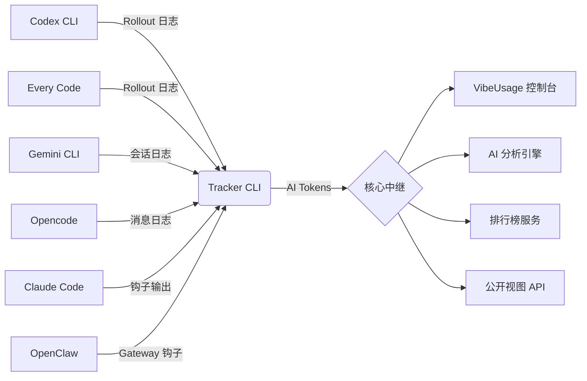

<div align="center">


# 🟢 VIBEUSAGE

**量化你的 AI 产出**
_追踪所有 AI CLI 工具的 Token 使用量_

[**www.vibeusage.cc**](https://www.vibeusage.cc)

[](https://opensource.org/licenses/MIT)
[](https://www.npmjs.com/package/vibeusage)
[](https://nodejs.org/)
[](https://www.apple.com/macos/)

[**English**](README.md) • [**中文说明**](README.zh-CN.md)

[**文档**](docs/) • [**控制台**](https://www.vibeusage.cc) • [**后端接口**](BACKEND_API.md)

<br/>


</div>

---

## 🚀 快速开始

30 秒即可上手：

```bash
npx vibeusage init
```

就这样！你的 AI token 使用量将自动同步到[控制台](https://www.vibeusage.cc) 🎉

## ✨ 为什么选择 VibeUsage？

- 📡 **多来源统一追踪** - 支持 Codex CLI、Every Code、Gemini CLI、Claude Code、Opencode、OpenClaw 等多个 AI CLI 工具
- 🤖 **多模型统计** - 统一追踪 GPT-4、Claude、Gemini、o1 等所有 AI 模型的 token 消耗
- 📁 **项目 AI 足迹** - 按仓库追踪并公开展示 token 使用量，证明这是 AI 辅助开发的项目
- 🏆 **全球排行榜** - 周榜/月榜/总榜实时更新，与全球开发者社区一起成长
- 🌐 **公开档案** - 分享你的 AI 使用旅程，可选公开参与排行榜
- 🔒 **隐私优先** - 只统计数字，永不上传你的代码和对话
- ⚡ **零配置自动同步** - 设置一次，终身自动
- 🎨 **Matrix-A 设计** - 赛博朋克风格的高颜值控制台
- 📈 **深度分析** - 成本洞察、趋势预测、活动热图

## 🧰 支持的 AI CLI

| CLI 工具 | 自动检测 | 状态 |
|----------|---------|------|
| **Codex CLI** | ✅ | 完全支持 |
| **Every Code** | ✅ | 完全支持 |
| **Gemini CLI** | ✅ | 完全支持 |
| **Claude Code** | ✅ | 完全支持 |
| **Opencode** | ✅ | 完全支持 |
| **OpenClaw** | ✅ | 完全支持 |

无论你使用 GPT-4、Claude 3.5 Sonnet、o1 还是 Gemini，所有 token 消耗都会被统一追踪。

## 🌌 项目概述

**VibeUsage** 是一个专为 macOS 开发者设计的智能 token 使用追踪系统。通过全新的 **Matrix-A Design System**，它提供高度可视化的赛博朋克风格仪表盘，将你的 **AI 产出** 转化为可量化的指标，并支持通过 **Neural Divergence Map** 实时监控多模型的算力分布。

> [!TIP]
> **核心指数**：我们的标志性指标，通过分析 token 消耗速率与模式，反映你的开发心流状态。

## 📊 控制台功能

### 🎨 Matrix-A 设计系统
使用 React + Vite 构建的高性能控制台，配备赛博朋克风格的设计语言：
- **Neural Divergence Map**：可视化多引擎负载均衡和算力分布
- **成本智能**：实时、多维度的成本分解和预测
- **活动热图**：GitHub 风格的贡献图表，带连击追踪
- **智能通知**：非侵入式的系统级提醒，采用 Golden 视觉风格

### 📈 分析与洞察
- **AI 分析**：深度分析输入/输出 token，专门追踪缓存和推理组件
- **模型分解**：按模型统计使用量和成本分析
- **项目统计**：按 GitHub 仓库追踪 token 使用量
- **趋势预测**：预测未来使用模式

### 🏆 社区功能
- **全球排行榜**：日榜、周榜、月榜和总榜，隐私安全的显示名称
- **公开档案**：使用隐私安全的公开档案分享你的 AI 使用旅程
- **排行榜分类**：参与总体排名或按特定模型（GPT、Claude 等）竞争


## 🔒 隐私保证

我们相信你的代码和想法属于你自己。VibeUsage 采用严格的隐私保护架构，确保你的数据始终受控。

| 保护措施 | 说明 |
|---------|------|
| 🛡️ **不上传内容** | 永不上传 prompt 或响应 - 仅在本地计算 token 数量 |
| 📡 **本地聚合** | 所有分析在本地完成 - 仅发送 30 分钟使用桶 |
| 🔐 **哈希身份** | 设备 token 在服务端使用 SHA-256 哈希 - 原始凭据从不存储 |
| 🔦 **完全透明** | 可以在 `src/lib/rollout.js` 中审计同步逻辑 - 真的只有数字和时间戳 |

## 📦 安装

### 标准设置

一次初始化环境 - VibeUsage 会在后台自动处理所有同步：

```bash
npx vibeusage init
```

### 认证方式

1. **浏览器认证**（默认）- 打开浏览器进行安全认证
2. **链接码** - 使用 `--link-code` 通过控制台生成的代码进行认证
3. **密码** - 直接密码登录（备选）
4. **访问令牌** - 用于 CI/自动化环境

### CLI 选项

```bash
npx vibeusage init [选项]

选项:
  --yes              跳过确认提示（非交互环境）
  --dry-run          预览更改但不实际写入文件
  --link-code <code> 使用控制台的链接码进行认证
  --base-url <url>   覆盖默认 API 端点
  --debug            启用调试输出
```

### 自动配置

`init` 完成后，所有支持的 CLI 工具都会自动配置数据同步：

| 工具 | 配置位置 | 方法 |
|-----|---------|-----|
| **Codex CLI** | `~/.codex/config.toml` | `notify` 钩子 |
| **Every Code** | `~/.code/config.toml`（或 `CODE_HOME`） | `notify` 钩子 |
| **Gemini CLI** | `~/.gemini/settings.json`（或 `GEMINI_HOME`） | `SessionEnd` 钩子 |
| **Opencode** | 全局插件 | 消息解析器插件 |
| **Claude Code** | `~/.claude/hooks/` | 钩子配置 |
| **OpenClaw** | 安装时自动链接 | Gateway 钩子（需要重启） |

无需进一步操作！🎉

## 💡 使用方法

### 手动同步

虽然同步是自动进行的，但你可以随时手动触发同步：

```bash
# 手动同步最新的本地会话数据
npx vibeusage sync

# 检查当前链接状态
npx vibeusage status
```

### 健康检查

运行综合诊断以识别问题：

```bash
# 基本健康检查
npx vibeusage doctor

# JSON 输出用于调试
npx vibeusage doctor --json --out doctor.json

# 针对不同端点进行测试
npx vibeusage doctor --base-url https://your-instance.insforge.app
```

### 调试模式

启用调试输出以查看详细的请求/响应信息：

```bash
VIBEUSAGE_DEBUG=1 npx vibeusage sync
# 或
npx vibeusage sync --debug
```

### 卸载

```bash
# 标准卸载（保留数据）
npx vibeusage uninstall

# 完全清除 - 删除所有数据，包括配置和缓存的会话
npx vibeusage uninstall --purge
```

## 🏗️ 架构



### 技术栈

- **CLI**：Node.js 20.x、CommonJS
- **控制台**：React 18 + Vite + TailwindCSS + TypeScript
- **后端**：InsForge Edge Functions (Deno)
- **数据库**：InsForge Database (PostgreSQL)
- **设计**：Matrix-A Design System

### 组件

- **Tracker CLI**（`src/`）：Node.js CLI，解析多个 AI 工具的日志并同步 token 数据
- **核心中继**（InsForge Edge Functions）：无服务器后端，处理摄入、聚合和 API
- **控制台**（`dashboard/`）：React + Vite 前端用于可视化
- **AI 分析引擎**：成本计算、模型分解和使用预测

### 数据流

1. AI CLI 工具在使用过程中生成日志
2. 本地 `notify-handler` 检测更改并触发同步
3. CLI 增量解析日志，提取 token 计数（仅白名单字段）
4. 数据在本地聚合到 30 分钟 UTC 桶中
5. 批量上传到 InsForge，带幂等去重
6. 控制台查询聚合结果进行可视化

### 日志源

| 工具 | 日志位置 | 覆盖环境变量 |
|-----|---------|------------|
| **Codex CLI** | `~/.codex/sessions/**/rollout-*.jsonl` | `CODEX_HOME` |
| **Every Code** | `~/.code/sessions/**/rollout-*.jsonl` | `CODE_HOME` |
| **Gemini CLI** | `~/.gemini/tmp/**/chats/session-*.json` | `GEMINI_HOME` |
| **Opencode** | `~/.opencode/messages/*.json` | - |
| **Claude Code** | 从钩子输出解析 | - |
| **OpenClaw** | Gateway 钩子集成 | - |

## ⚙️ 配置

<details>
<summary><b>环境变量</b></summary>

### 核心设置

| 变量 | 说明 | 默认值 |
|-----|------|-------|
| `VIBEUSAGE_HTTP_TIMEOUT_MS` | CLI HTTP 超时（毫秒）（`0` 禁用，限制 `1000..120000`） | `20000` |
| `VITE_VIBEUSAGE_HTTP_TIMEOUT_MS` | 控制台请求超时（毫秒）（`0` 禁用，限制 `1000..30000`） | `15000` |
| `VIBEUSAGE_DEBUG` | 启用调试输出（`1` 或 `true` 启用） | - |
| `VIBEUSAGE_DASHBOARD_URL` | 自定义控制台 URL | `https://www.vibeusage.cc` |
| `VIBEUSAGE_INSFORGE_BASE_URL` | 自定义 API 基础 URL | `https://5tmappuk.us-east.insforge.app` |
| `VIBEUSAGE_DEVICE_TOKEN` | 预配置设备令牌（用于 CI） | - |

### CLI 工具覆盖

| 变量 | 说明 | 默认值 |
|-----|------|-------|
| `CODEX_HOME` | Codex CLI 目录覆盖 | `~/.codex` |
| `CODE_HOME` | Every Code 目录覆盖 | `~/.code` |
| `GEMINI_HOME` | Gemini CLI 目录覆盖 | `~/.gemini` |

</details>

## 🔧 故障排查

<details>
<summary><b>数据未出现在控制台中</b></summary>

1. 检查状态：`npx vibeusage status`
2. 强制手动同步：`npx vibeusage sync`
3. 验证 CLI 工具钩子已配置（如需要，重新运行 `init`）
4. 检查调试输出：`VIBEUSAGE_DEBUG=1 npx vibeusage sync`

</details>

<details>
<summary><b>连击显示 0 天，但总数看起来正确</b></summary>

连击定义为连续到今天的天数。如果今天的总数为 0，连击将为 0。

如果你期望非零连击，清除缓存的认证/热图数据并重新登录：

```javascript
localStorage.removeItem("vibeusage.dashboard.auth.v1");
Object.keys(localStorage)
  .filter((k) => k.startsWith("vibeusage.heatmap."))
  .forEach((k) => localStorage.removeItem(k));
location.reload();
```

重新加载后完成落地页登录流程。

注意：控制台不使用 `insforge-auth-token`；使用 `vibeusage.dashboard.auth.v1`。

</details>

<details>
<summary><b>慢速连接上的超时错误</b></summary>

为慢速连接增加 HTTP 超时：

```bash
VIBEUSAGE_HTTP_TIMEOUT_MS=60000 npx vibeusage sync
```

</details>

## 💻 开发

### 本地开发

```bash
# 克隆仓库
git clone https://github.com/your-username/vibeusage.git
cd vibeusage

# 安装依赖
npm install

# 启动控制台开发服务器
cd dashboard
npm install
npm run dev
```

### 开发命令

```bash
# 运行测试
npm test

# 运行本地 CI 检查
npm run ci:local

# 验证文案注册表
npm run validate:copy

# 验证 UI 硬编码文本
npm run validate:ui-hardcode

# 验证架构防护栏
npm run validate:guardrails

# 构建后端函数
npm run build:insforge

# 检查后端构建（不写入）
npm run build:insforge:check

# 运行冒烟测试
npm run smoke
```

### OpenSpec 工作流

本项目使用 **OpenSpec** 进行规格驱动开发。在进行重大更改之前：

1. 阅读 [`openspec/project.md`](openspec/project.md) 了解项目约定
2. 查看 [`openspec/AGENTS.md`](openspec/AGENTS.md) 了解完整的 OpenSpec 工作流
3. 运行 `openspec list` 查看活跃的更改
4. 运行 `openspec list --specs` 查看现有规格

详见 [CLAUDE.md](CLAUDE.md) 了解详细指南。

### 架构验证

```bash
# 验证文案注册表
npm run validate:copy

# 生成架构画布
npm run architecture:canvas

# 为模块生成聚焦画布
npm run architecture:canvas:focus -- src
```

## 🗺️ 路线图

- [ ] Windows 支持
- [ ] Linux 支持
- [ ] 增强的项目级统计
- [ ] 团队协作功能
- [ ] 自定义报告导出
- [ ] 更多 AI CLI 支持

查看 [Issues](https://github.com/your-username/vibeusage/issues) 了解详细计划。

## 🤝 贡献

我们欢迎所有形式的贡献！

1. Fork 仓库
2. 创建功能分支（`git checkout -b feature/amazing-feature`）
3. 提交你的更改（`git commit -m 'Add amazing feature'`）
4. 推送到分支（`git push origin feature/amazing-feature`）
5. 创建 Pull Request

### 开发指南

- 所有用户界面文本必须在 `dashboard/src/content/copy.csv` 中注册
- 对于重大更改，遵循 OpenSpec 提案流程
- 代码必须通过所有测试和验证
- 详见 [CLAUDE.md](CLAUDE.md) 了解详细约定

## 📜 许可证

本项目采用 [MIT 许可证](LICENSE)。

## 🙏 致谢

- [InsForge](https://insforge.app) - 后端基础设施
- [Matrix-A Design System](docs/dashboard/matrix-a.md) - UI 框架
- 所有出色的贡献者

---

<div align="center">
  <b>System_Ready // 2024-2026 VibeUsage</b><br/>
  <i>"量化你的 AI 产出。拥有你的数据。"</i><br/><br/>

  由开发者制作，为开发者服务 💚

  [网站](https://www.vibeusage.cc) •
  [控制台](https://www.vibeusage.cc) •
  [文档](docs/) •
  [API](BACKEND_API.md)
</div>
